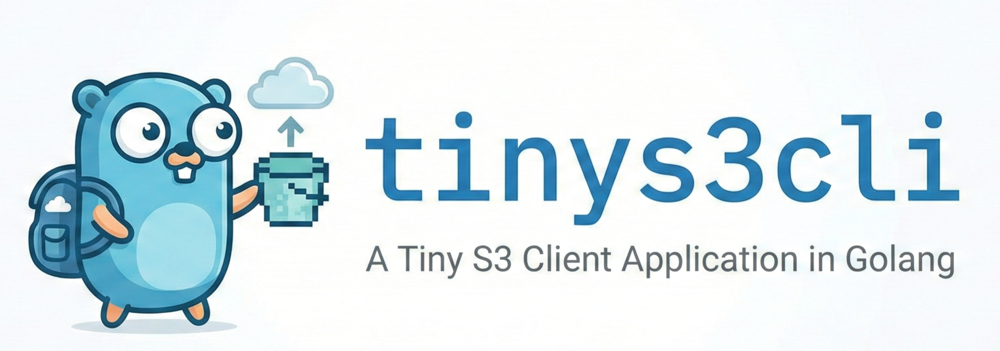

A Tiny S3 Client written in Go. Upload, download, and list S3 objects with parallel operations.

## Features

- Parallel uploads and downloads with CPU-aware worker count
- Configurable worker count via flags or environment variable
- Recursive directory operations
- S3 URI support (`s3://bucket/path`)
- AWS SDK v2 integration

## Requirements

- Go 1.21+
- AWS credentials (via `~/.aws/credentials` or environment variables)

## Installation

### From Source

```sh
go install github.com/lucidfrontier45/tinys3cli@latest
```

### Building from Source

```sh
git clone https://github.com/lucidfrontier45/tinys3cli.git
cd tinys3cli
go build -o tinys3cli .
```

### Docker

```dockerfile
COPY --from=ghcr.io/lucidfrontier45/tinys3cli:latest /tinys3cli /usr/local/bin/
```

## Configuration

tinys3cli uses the standard AWS configuration:

- Credentials: `~/.aws/credentials` or environment variables (`AWS_ACCESS_KEY_ID`, `AWS_SECRET_ACCESS_KEY`)
- Region: `~/.aws/config` or `AWS_REGION` environment variable

### Worker Pool Configuration

The worker pool size determines parallel transfer operations and can be configured in three ways (priority order):

1. **Command-line flag**: `--jobs` or `-j` (highest priority)
2. **Environment variable**: `TINYS3_JOBS` 
3. **CPU-aware default**: Automatically calculated as `2 × Number of CPU cores` (lowest priority)

The default worker count is calculated based on available CPU cores and is automatically clamped to a safe range (minimum 1, maximum `10 × Number of CPU cores`). If the value is out of range, a warning is displayed and the value is clamped.

## Usage

### Path Validation

tinys3cli validates paths for security and safety:

**Local Paths:**
- Cannot contain directory traversal sequences (`../` or `..\`)
- Cannot start with `..`
- Must stay within the specified base directory

**S3 Paths:**
- Must use the format `s3://bucket/path/to/object`
- Cannot contain directory traversal sequences (`../` or `..\`)
- Cannot start with `..`

### List Objects

List objects in a bucket with optional prefix:

```sh
tinys3cli list s3://my-bucket/path/to/objects
```

### Upload

Upload a single file:

```sh
tinys3cli put /path/to/file.txt s3://my-bucket/
```

Upload multiple files:

```sh
tinys3cli put file1.txt file2.txt file3.txt s3://my-bucket/
```

Upload a directory recursively:

```sh
tinys3cli put /path/to/directory s3://my-bucket/backup/
```

#### Upload Flags

| Flag                    | Short | Default | Description                       |
| ----------------------- | ----- | ------- | --------------------------------- |
| `--jobs`                | `-j`  | CPU × 2 | Number of parallel upload workers |
| `--no-local-path-check` |       | false   | Disable local path validation     |

### Download

Download a single file:

```sh
tinys3cli get s3://my-bucket/file.txt /path/to/destination/
```

Download to a specific filename:

```sh
tinys3cli get s3://my-bucket/file.txt ./renamed.txt
```

Download a directory recursively:

```sh
tinys3cli get -r s3://my-bucket/folder/ /local/path/
```

#### Download Flags

| Flag                    | Short | Default | Description                         |
| ----------------------- | ----- | ------- | ----------------------------------- |
| `--recursive`           | `-r`  | false   | Download directories recursively    |
| `--jobs`                | `-j`  | CPU × 2 | Number of parallel download workers |
| `--version-id`          | `-v`  | ""      | Download a specific object version  |
| `--no-local-path-check` |       | false   | Disable local path validation       |

### Version

Show the application version:

```sh
tinys3cli version
```

## Help

```sh
tinys3cli --help
tinys3cli list --help
tinys3cli put --help
tinys3cli get --help
```

## Examples

### Set Worker Count via Environment Variable

```sh
export TINYS3_JOBS=16
tinys3cli put ./mywebsite s3://my-bucket/website/
```

### Sync Local Directory to S3

```sh
tinys3cli put -j 8 ./mywebsite s3://my-bucket/website/
```

### Sync S3 Bucket to Local Directory

```sh
tinys3cli get -r -j 8 s3://my-bucket/website/ ./mywebsite/
```

### Upload without Local Path Validation

```sh
tinys3cli put --no-local-path-check ../../file.txt s3://my-bucket/
```

### Download Specific Version

```sh
tinys3cli get --version-id "abc123" s3://my-bucket/file.txt ./file.txt
```

### Download without Local Path Validation

```sh
tinys3cli get --no-local-path-check s3://my-bucket/file.txt ../../file.txt
```

## License

Copyright (c) 2022 Du Shiqiao
